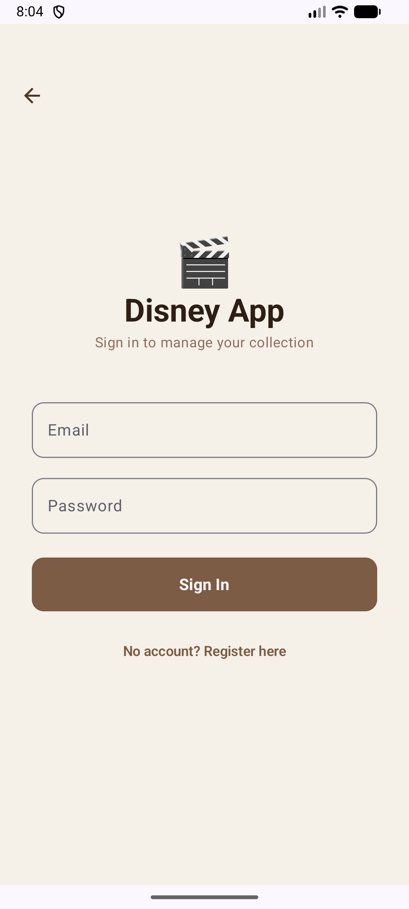
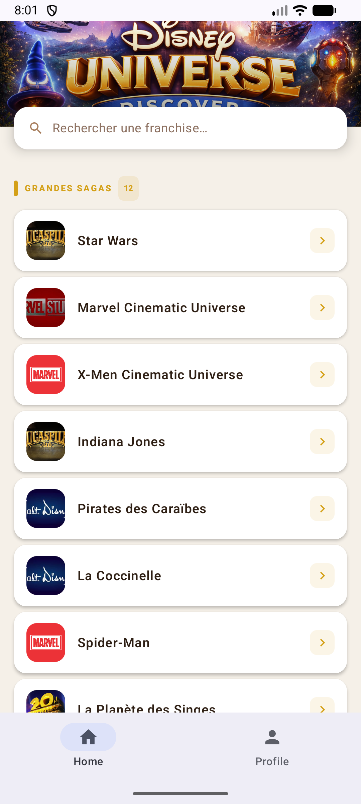
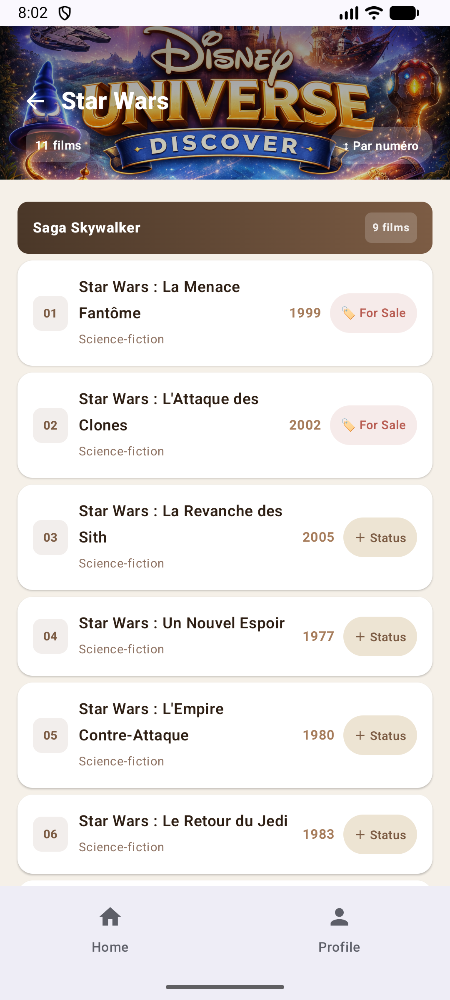
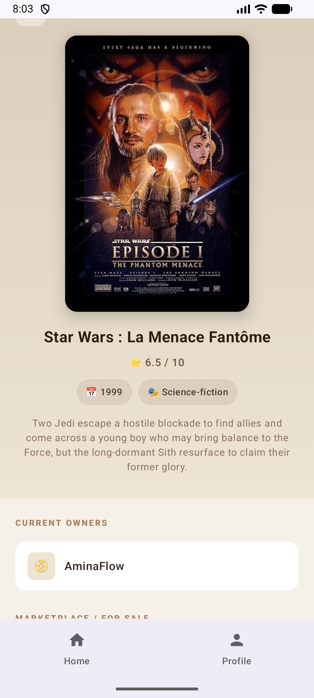
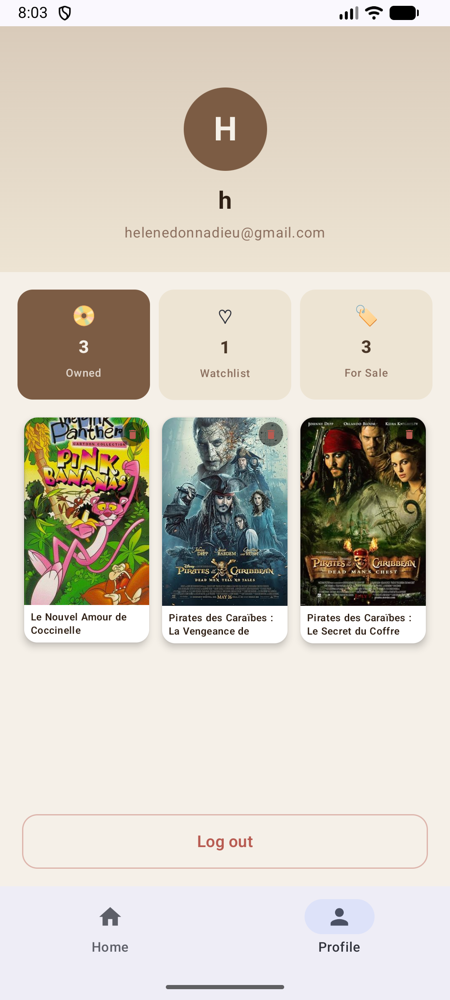

#  Disney Filmography App

An Android application about the Walt Disney Company universe, 
built with Jetpack Compose and Firebase.


##  Features
- Authentication - Login / Register / Profile page (Firebase Auth)
- Universes - Browse by universe (Marvel, Disney, Pixar, Star Wars, Avatar...)
- Films - List of films with release dates, by universe and category
- Film Status - Mark films as:
  - Watched
  - Want to watch
  - Own on DVD/Blu-Ray
  - Want to get rid of
- Social - See which users own a film or wish to get rid of it
- Profile - Manage your owned films list

## 📸 Screenshots

| Login | Universe | Film List | Film Detail | Profile |
|-------|----------|-----------|-------------|---------|
|  |  |  |  |  |

##  Tech Stack

- Kotlin - Main language
- Jetpack Compose - UI framework
- Firebase Authentication - User login & registration
- Firebase Realtime Database - Cloud database
- OMDB API - Movie posters and details
- Navigation Compose - Screen navigation
- ViewModel - State management

##  Project Structure
```
app/src/main/java/fr/isen/donnadieu/disney/
├── MainActivity.kt
├── auth/
│   ├── AuthViewModel.kt
│   ├── LoginScreen.kt
│   └── RegisterScreen.kt
├── data/
│   ├── api/OmdbApi.kt
│   └── model/OmdbMovie.kt
└── ui/
    ├── films/
    │   ├── FilmDetailScreen.kt
    │   ├── FilmListScreen.kt
    │   └── FilmStatusViewModel.kt
    ├── profile/ProfileScreen.kt
    ├── theme/
    └── universe/UniverseScreen.kt

##  Getting Started

1. Clone the repository
git clone https://github.com/donnadieu/disney.git
2. Add your `google-services.json` to the `app/` folder
3. Open in **Android Studio** and run on an emulator or device (API 24+)

##  Team

Helene Donnadieu
Aminata Yade
- ISEN 2026

